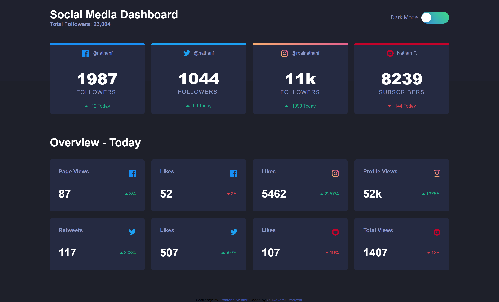
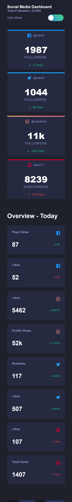
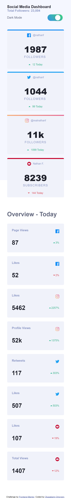
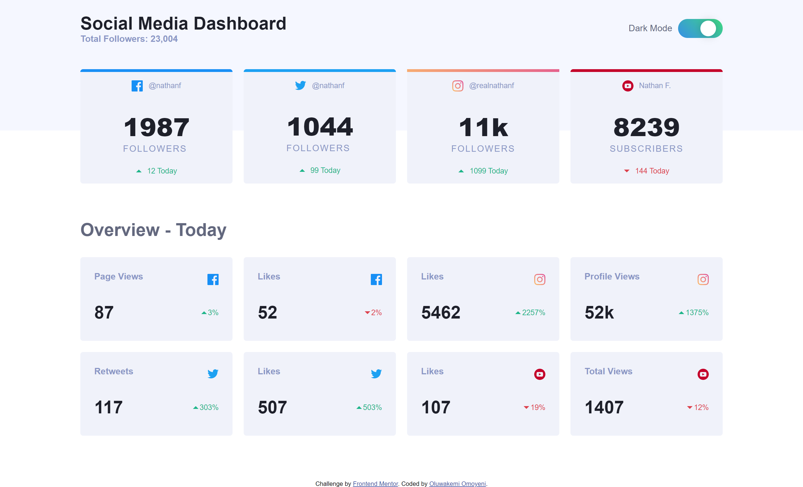

# Frontend Mentor - Social media dashboard with theme switcher solution

This is a solution to the [Social media dashboard with theme switcher challenge on Frontend Mentor](https://www.frontendmentor.io/challenges/social-media-dashboard-with-theme-switcher-6oY8ozp_H). Frontend Mentor challenges help you improve your coding skills by building realistic projects. 

## Table of contents

- [Overview](#overview)
  - [The challenge](#the-challenge)
  - [Screenshot](#screenshot)
  - [Links](#links)
- [My process](#my-process)
  - [Built with](#built-with)
  - [What I learned](#what-i-learned)
  - [Continued development](#continued-development)
  - [Useful resources](#useful-resources)
- [Author](#author)
- [Acknowledgments](#acknowledgments)


## Overview

### The challenge

Users should be able to:

- View the optimal layout for the site depending on their device's screen size
- See hover states for all interactive elements on the page
- Toggle color theme to their preference

### Screenshot







### Links

- Solution URL: [Add solution URL here](https://www.frontendmentor.io/solutions/theme-switch-with-javascript-j4yWa6LgZ)
- Live Site URL: [Add live site URL here](https://nostalgic-visvesvaraya-88b108.netlify.app/)

## My process

### Built with

- Semantic HTML5 markup
- CSS custom properties
- Flexbox
- CSS Grid
- Mobile-first workflow
- Javascript for the theme switch


### What I learned

- This project expands my knowlegde of CSS Flexbox and grid 
- I also learnt how to switch theme with Javascript using the Local storage
- The theme switch forced me to learn how to use CSS variables because it provides a straightforward means for the switching.


```css
/* Using css variables */
.theme-light {
    --heading: hsl(230, 17%, 14%);
    --bg-top: hsl(225, 100%, 98%);
    --bg-down:hsl(0, 0%, 100%);
    --card-bg:  hsl(227, 47%, 96%);
    --card-hover:  hsl(228deg, 12% , 80%);
    --card-text: hsl(228, 12%, 44%);
    --overview: hsl(228, 12%, 44%);
}
.theme-dark {
    --heading: hsl(0, 0%, 100%);
    --bg-top: hsl(232, 19%, 15%);
    --bg-down: hsl(230, 17%, 14%);
    --card-bg: hsl(228, 28%, 20%);
    --card-hover: hsl(228, 12%, 44%);
    --card-text: hsl(228, 34%, 66%);
    --overview: hsl(0, 0%, 100%);
    --toggle: linear-gradient(45deg,  hsl(210, 78%, 56%), hsl(146, 68%, 55%));
}
```
```js
// function to toggle between light and dark theme
function toggleTheme() {
    if (localStorage.getItem('theme') === 'theme-dark') {
            setTheme('theme-light');
    } else {
            setTheme('theme-dark');
    }
}
```

### Continued development

- Practice more with CSS GRid and Flexbox


### Useful resources

- [Gradient border](https://css-tricks.com/gradient-borders-in-css/) - This helped me to add a gradient border to the instagram card. CSS Tricks is pretty good for anyone trying to work around CSS.
- [Theme Switch](https://medium.com/@haxzie/dark-and-light-theme-switcher-using-css-variables-and-pure-javascript-zocada-dd0059d72fa2) - This is an amazing article which helped me finally understand how to switch theme with JS. I'd recommend it to anyone still learning this concept.


## Author

- Website - [Oluwakemi Omoyeni](https://www.kemi.jwitedu.com.ng)
- Frontend Mentor - [@Captressketh001](https://www.frontendmentor.io/profile/@Captressketh001)
- Twitter - [@capketh](https://www.twitter.com/cap_keth)


## Acknowledgments

- I will like to acknowledge the input of Praise Adeleke, a colleague and a friend.

